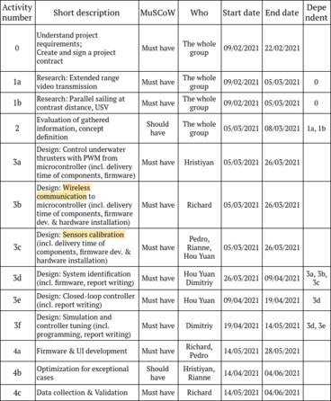
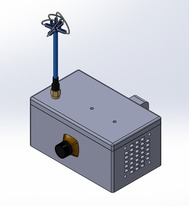
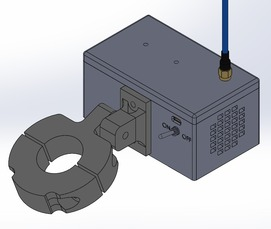
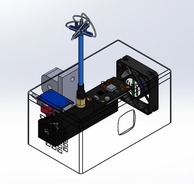
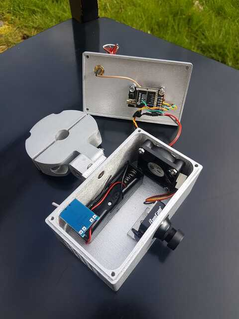

## About the project

This project follows the develepoment of a control system for an unmanned surface vehicle (USV).
It consists of efficient code to read the PWM output of an RC receiver via Pin Change Interrupts and write PWM to the ESCs controlling underwater thrusters.
An IMU sensor is used to keep track of the vehicle's orientation, while Time-of-Flight (ToF) sensors measure the distance to canal walls and control the orientation via PID algorithm.

## Introduction

Inspection of bridges and quay walls, below or above the water line, is the main activity of oQuay.
They conduct inspection in different ways but one of their key instruments is a sonar camera attached to a USV, called the HyDrone.
In order to make recordings of high quality it is important to sail the HyDrone at a constant distance (parallel) to quay walls.
During operation, the position of the vehicle is affected by wind and water currents, making the sonar images blurry.
The lack of a control system to correct the HyDrones orientation is a pitfall in the design and affects the quality of the inspection work.
Moreover, the GoPro camera on the HyDrone has a short transmission range of ~10m.
This becomes a problem when the HyDrone sails further away, losing the video feedback and the control over the camera.
oQuay are looking for something that can guarantee control of the movement of the vehicle and a device that can increase the transmission range of their GoPro camera.

Assembly files are in the relevant repositoty folders.


## MuSCoW

| Must haves                                                                            | Should haves                                                    | Could haves                                                                                           |
|---------------------------------------------------------------------------------------|-----------------------------------------------------------------|-------------------------------------------------------------------------------------------------------|
| Independent adjustment of the orientation of the HyDrone with respect to canal walls | Orientation correction should be smooth with no oscillations   | Adjustment mechanism to adapt for different situations - different heights and shapes of canal walls |
| Sailing at a constant distance 70cm~1m                                               | Stable response in spite of wind and water currents            | Audible feedback from the control commands - start/stop could be indicated with some type of sound   |
| Increased video transmission range to at least 100 meters                            | Validation with experiments in real canal environment          |                                                                                                       |
| Increased GoPro control range to at least 100 meters                                 | Developed system should be portable and detachable             |                                                                                                       |
| Control system must not exceed €100                                                  | Power source of the system should be rechargeable              |                                                                                                       |
| Real-time transmission of the video signal                                           | Video should be shown on one of the already available displays |                                                                                                       |

## Planning




## Pin Change Interrupts

```c
PCICR |= (1 << PCIE0);   // set PCIE0 bit to to enable PCMSK0 scan
PCMSK0 |= (1 << PCINT0); // set PCINT0 (digital pin 8) to trigger an interrupt on state change
PCMSK0 |= (1 << PCINT1); // set PCINT0 (digital pin 9) to trigger an interrupt on state change
PCMSK0 |= (1 << PCINT2); // set PCINT0 (digital pin 10) to trigger an interrupt on state change
PCMSK0 |= (1 << PCINT3); // set PCINT0 (digital pin 11) to trigger an interrupt on state change

// Interrupt service routine called evey time digital input pin 8, 9, 10, or 11 changes state
// PCINT0_vect is the compiler vector for PCINT0 on PORTB of ATmega328
ISR(PCINT0_vect)
{
  //    // Channel 1==================================
  if (last_channel_1_state == 0 && PINB & B00000001)
  {
    last_channel_1_state = 1;
    timer_channel_1 = micros();
  }
  if (last_channel_1_state == 1 && !(PINB & B00000001))
  {
    last_channel_1_state = 0;
    receiver_input_channel_1 = micros() - timer_channel_1;
  }
  // Channel 2==================================
  if (last_channel_2_state == 0 && PINB & B00000010)
  {
    last_channel_2_state = 1;
    timer_channel_2 = micros();
  }
  if (last_channel_2_state == 1 && !(PINB & B00000010))
  {
    last_channel_2_state = 0;
    receiver_input_channel_2 = micros() - timer_channel_2;
  }
  //    // Channel 3==================================
  if (last_channel_3_state == 0 && PINB & B00000100)
  {
    last_channel_3_state = 1;
    timer_channel_3 = micros();
  }
  if (last_channel_3_state == 1 && !(PINB & B00000100))
  {
    last_channel_3_state = 0;
    receiver_input_channel_3 = micros() - timer_channel_3;
  }
  //    // Channel 4==================================
  if (last_channel_4_state == 0 && PINB & B00001000)
  {
    last_channel_4_state = 1;
    timer_channel_4 = micros();
  }
  if (last_channel_4_state == 1 && !(PINB & B00001000))
  {
    last_channel_4_state = 0;
    receiver_input_channel_4 = micros() - timer_channel_4;
  }
}
```

## FPV System










## Control System

